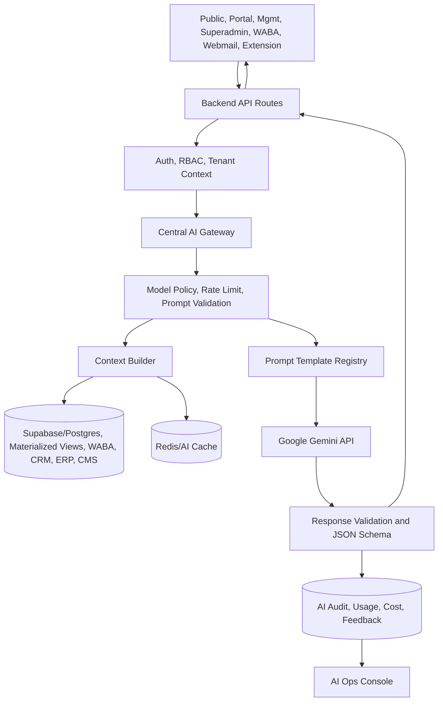

# TecBunny AI-First Gemini Architecture Plan

Date: 2026-07-19

## Executive Summary

TecBunny is already a multi-application enterprise SaaS platform with public commerce, customer portal workflows, management operations, superadmin governance, WABA messaging, webmail, a Chrome extension, a central API app, shared packages, and a large Supabase/Postgres enterprise schema.

The platform should become AI-first through governed, context-aware Gemini services that improve measurable business outcomes: faster sales follow-up, better customer self-service, lower support handling time, better inventory decisions, stronger executive visibility, and safer operations. This should not become a generic chat layer. Gemini should be integrated only where it can automate work, summarize complex data, improve decisions, or generate operational content with traceable value.

Important repository finding: Gemini usage should stay centralized behind backend service APIs. Several WABA and API routes call `@google/generative-ai` directly today, so Phase 0 should consolidate those calls behind the shared Gemini gateway before adding more AI features.

## Current Repository AI State

Existing AI-related surfaces:

| Area | Existing surface | Assessment |
|---|---|---|
| Shared core | `packages/core/src/ai/gemini-service.ts`, `prompts.ts`, `tax-classification.ts` | Must evolve into a full Gemini gateway with model routing, audit, cost, validation, and streaming. |
| Public/API | Product description, product details, research, scraper AI endpoints | Useful but should move behind the governed AI service and standardized prompt library. |
| Management | `/api/admin/ai-query`, admin AI assistant page, product description, AI product add | High-value foundation, but context retrieval is keyword based and not yet a general natural-language query planner. |
| Superadmin | AI service generation endpoint, AI config screen | Good governance entry point; expand into AI operations console. |
| WABA | Inbound triage agent, copilot command, auto-draft/rewrite | Strong AI fit. Needs central service, PII boundaries, audit, usage tracking, and reliable knowledge retrieval. |
| Webmail | UI and health only | AI features should wait until mailbox provider CRUD/sync exists. |
| Database | `wab_ai_summaries`, `wab_ai_suggestions`, `rpt_ai_insights`, `sys_api_logs`, `sys_security_events` | Good base tables exist, but missing global AI request ledger, prompt versioning, cost tracking, model policy, embeddings, and cache tables. |

## AI Opportunity Matrix

Priority meanings:

- Critical: Direct revenue, customer experience, risk reduction, or operational leverage. Build in Phase 1.
- High Value: Strong productivity or decision support. Build after core service is stable.
- Optional: Useful but not required for launch.
- Future Enhancement: Needs more data maturity, embeddings, analytics history, or workflow readiness.

| Feature Name | Module | Purpose | Business Value | User Benefit | Gemini Model Recommendation | Required API | Database Changes | Frontend Changes | Priority | Effort |
|---|---|---|---|---|---|---|---|---|---|---|
| Central Gemini Gateway | Shared API/Core | Single backend entry for all Gemini calls | Prevents key leaks, lowers cost, standardizes safety | Consistent AI behavior | Gemini 2.5 Flash, Flash Lite, Pro by policy | `POST /api/ai/generate`, `POST /api/ai/stream` | `ai_requests`, `ai_usage_daily`, `ai_prompt_versions`, `ai_model_policies` | None initially | Critical | L |
| AI Audit and Cost Ledger | API/Superadmin | Track prompts, redacted context, tokens, latency, cost | Enables compliance and cost control | Transparent admin reporting | N/A | `GET /api/ai/usage`, `GET /api/ai/audit` | `ai_requests`, `ai_response_feedback` | Superadmin AI ops console | Critical | M |
| Natural Language Admin Query | Management | Ask business questions over orders, customers, products, services, analytics | Reduces manual report work | Managers get answers without SQL/export | Gemini 2.5 Flash with structured output | `POST /api/ai/query/admin` | `ai_query_runs`, optional saved query mapping | Replace current keyword assistant with query panel and result cards | Critical | L |
| WABA Reply Suggestions | WABA | Suggest high-quality agent replies from conversation and customer context | Faster response, better conversion | Agents answer quicker | Gemini 2.5 Flash Lite for drafts, Flash for complex cases | `POST /api/ai/waba/reply-suggestions` | Extend `wab_ai_suggestions` with intent, tone, model, token data | Inline suggestions in chat composer | Critical | M |
| WABA Conversation Summary | WABA | Summarize chat, sentiment, intent, open actions | Faster handoff, less context loss | Agents see customer state instantly | Gemini 2.5 Flash Lite | `POST /api/ai/waba/summarize` | Extend `wab_ai_summaries` with action_items, sentiment_label | Summary panel in conversation sidebar | Critical | M |
| WABA Intent and Escalation | WABA | Classify intent, urgency, sentiment, next best action | Improves routing and SLA | Customers reach right team faster | Gemini 2.5 Flash structured JSON | `POST /api/ai/waba/triage` | Add fields to WABA conversation or new `wab_ai_classifications` | Badges, escalation prompts, queue filters | Critical | M |
| Customer Support Assistant | Public/Customer Portal | Answer order, warranty, support, service availability questions using account context | Reduces support tickets and abandoned journeys | Self-service answers | Gemini 2.5 Flash with retrieval | `POST /api/ai/customer/support` | `ai_conversations`, `ai_conversation_messages` | Portal assistant on orders, warranties, tickets | Critical | L |
| Product Recommendation Advisor | Public/Portal | Recommend products and setups from needs, budget, location | Increases conversion and average order value | Better buying guidance | Gemini 2.5 Flash + deterministic catalog scoring | `POST /api/ai/products/recommend` | `ai_recommendation_events` | Guided search/advisor in shop/product pages | Critical | L |
| Smart Product Search | Public/Portal | Natural language search like `CCTV under INR 50000 for shop` | Better discovery, lower bounce | Users search by need | Gemini embeddings + Flash query planner | `POST /api/search/ai` | `ai_search_logs`, `search_embeddings` or pgvector product embeddings | AI search box, filters from parsed intent | Critical | L |
| CRM Lead Scoring | Management CRM | Score leads by urgency, fit, budget, history | Prioritizes sales effort | Sales sees hot leads first | Gemini 2.5 Flash structured output | `POST /api/ai/crm/score-lead` | Add `ai_score`, `ai_reason`, `ai_last_scored_at` to leads or new scoring table | Lead center score badges and reasons | Critical | M |
| Lead and Customer Summary | Management CRM | Summarize customer profile, orders, tickets, notes, timeline | Reduces prep time | Staff get context fast | Gemini 2.5 Flash Lite | `POST /api/ai/crm/customer-summary` | `crm_ai_summaries` | Summary drawer on CRM/customer pages | Critical | M |
| Report Narrative Assistant | Reports/Dashboards | Answer `What happened this month?`, explain sales changes, summarize revenue | Better decisions, less spreadsheet time | Managers get plain-language insight | Gemini 2.5 Flash, Pro for complex multi-period analysis | `POST /api/ai/reports/analyze` | Extend `rpt_ai_insights`; add `rpt_ai_questions` | AI insight panel on reports/dashboard pages | Critical | L |
| Dashboard Insight Cards | Management/Superadmin | Generate anomalies, risks, opportunities from materialized views | Action-oriented dashboards | Users see what needs attention | Gemini 2.5 Flash Lite for scheduled summaries | `POST /api/ai/insights/generate`, scheduled job | Extend `rpt_ai_insights` with severity, entity refs | Insight cards on dashboards | Critical | M |
| Inventory Forecast and Purchase Suggestions | Management/ERP | Forecast low stock and suggest reorder | Prevents stockouts and dead stock | Better procurement decisions | Gemini 2.5 Flash plus deterministic forecasting | `POST /api/ai/inventory/forecast` | `inv_ai_forecasts`, `inv_purchase_suggestions` | Inventory reorder panel | High Value | L |
| Revenue Analysis | Management/Accounts | Explain revenue, margins, invoice/payment trends | Faster financial review | Managers understand drivers | Gemini 2.5 Flash, Pro for month-end | `POST /api/ai/finance/revenue-analysis` | `fin_ai_summaries` | Reports/Accounts narrative tab | High Value | M |
| Email Drafting and Reply Suggestions | Webmail/Management | Draft replies, improve tone, summarize threads | Faster customer communication | Better emails with less effort | Gemini 2.5 Flash Lite | `POST /api/ai/email/draft`, `POST /api/ai/email/summarize` | `mail_ai_drafts`, `mail_ai_thread_summaries` after webmail APIs exist | Composer actions and thread summary | High Value | M after webmail core |
| WABA Broadcast Content Generation | WABA/Marketing | Draft campaign copy and template variants | Faster campaigns, better quality | Marketing drafts faster | Gemini 2.5 Flash | `POST /api/ai/waba/broadcast-draft` | `mkt_ai_content_variants`, template audit | Campaign content assistant | High Value | M |
| Blog and SEO Assistant | Public CMS/Management | Draft blogs, meta descriptions, keywords, alt text | Improves organic traffic | Content team works faster | Gemini 2.5 Flash, Pro for long-form | `POST /api/ai/cms/content` | `cms_ai_drafts`, `cms_seo_ai_suggestions` | CMS buttons for draft, rewrite, SEO | High Value | M |
| Superadmin System Health Analysis | Superadmin | Analyze health checks, API logs, security events, latency | Faster incident review | Admin sees root causes | Gemini 2.5 Flash | `POST /api/ai/superadmin/system-health` | `sys_ai_health_reports` | System health AI summary | High Value | M |
| Permission Review Assistant | Superadmin/Security | Detect risky roles, broad permissions, stale users | Reduces access risk | Clear remediation suggestions | Gemini 2.5 Flash structured JSON | `POST /api/ai/security/permission-review` | `sys_ai_permission_reviews` | Role review panel | High Value | M |
| Audit Log Summary | Superadmin/Security | Summarize audit/security events by period | Faster compliance review | Admins detect suspicious changes | Gemini 2.5 Flash Lite | `POST /api/ai/security/audit-summary` | Extend `sys_security_events` or add `sys_ai_audit_summaries` | Audit logs summary drawer | High Value | M |
| Meeting Notes and Task Suggestions | Management | Convert notes/transcripts into tasks, follow-ups, CRM updates | Better follow-through | Staff leave meetings with actions | Gemini 2.5 Flash | `POST /api/ai/productivity/meeting-notes` | `ai_generated_tasks`, links to CRM activities | Notes assistant in CRM/tasks | Optional | M |
| Chrome Extension Product Import Copilot | Chrome Extension/API | Extract product data from supplier pages and normalize catalog fields | Speeds catalog onboarding | Staff import products faster | Gemini 2.5 Flash structured JSON | Existing scraper AI routed through gateway | AI request ledger, catalog import job logs | Extension review/import UI | High Value | M |
| Translation and Tone Tools | Webmail/WABA | Translate, simplify, professionalize replies | Better multilingual support | Staff writes polished content | Gemini 2.5 Flash Lite | `POST /api/ai/text/transform` | Request ledger only | Composer action menu | Optional | S |
| Spam and Priority Detection | Webmail/WABA | Classify message priority/spam/action required | Reduces inbox noise | Staff focus on important items | Gemini 2.5 Flash Lite, deterministic rules first | `POST /api/ai/messages/classify` | `mail_ai_classifications`, WABA classification table | Priority badges and filters | Optional | M |
| Predictive Churn and Next Best Offer | CRM/Reports | Predict inactive or churn-risk customers, suggest offers | Retention and repeat revenue | Sales gets target lists | Gemini Pro for reasoning, deterministic ML later | `POST /api/ai/crm/churn-risk` | `crm_ai_churn_scores` | CRM segment views | Future Enhancement | L |
| Executive Insights | Superadmin/Reports | Summarize company-wide performance, risks, opportunities | Leadership decision support | Executives get daily digest | Gemini 2.5 Pro for monthly, Flash for daily | `POST /api/ai/executive/briefing` | `rpt_ai_executive_briefings` | Executive dashboard digest | Future Enhancement | L |

## AI Features to Avoid or Defer

| Proposed AI use | Decision | Reason |
|---|---|---|
| AI on every static public service page | Avoid | Static pages are better served by authored content and SEO discipline. Use AI in CMS/admin, not on every user view. |
| Fully autonomous order changes | Avoid initially | High risk. AI may recommend actions, but humans or deterministic workflows should execute mutations. |
| AI payment/refund approval | Avoid initially | Financial risk and audit complexity. Use AI summaries only. |
| AI security enforcement without human review | Avoid | AI can flag risks, not directly revoke permissions in Phase 1. |
| Customer-facing open-ended general chatbot | Avoid | High hallucination and privacy risk. Use task-specific assistants grounded in catalog/order/warranty data. |

## AI Architecture Diagram



## Gemini Integration Plan

1. Keep `generateGeminiText` backed only by Gemini and evolve it into a full gateway interface.
2. Create a provider interface: `AIProvider.generateText`, `AIProvider.generateObject`, `AIProvider.streamText`, `AIProvider.embed`.
3. Route every AI call through a central backend service in `packages/core/src/ai` and app-level API routes.
4. Remove direct `new GoogleGenerativeAI(...)` usage from WABA/API routes.
5. Store prompt templates and versions in code plus database overrides for superadmin-approved changes.
6. Add request-scoped context builders for CRM, WABA, catalog, reports, security, webmail, and customer portal.
7. Validate inputs with Zod and validate model outputs with JSON schemas where actions or structured data are required.
8. Add streaming for long answers and reports, background jobs for scheduled insights, and Redis caching for repeated context-heavy queries.
9. Add usage telemetry, audit logs, cost estimates, rate limits, safety filters, redaction, and admin visibility before scaling usage.

## AI Service Layer Design

Recommended package structure:

```text
packages/core/src/ai/
  index.ts
  gateway.ts
  providers/
    gemini-provider.ts
  model-policy.ts
  prompt-registry.ts
  prompt-renderer.ts
  context-builders/
    admin-query-context.ts
    customer-context.ts
    crm-context.ts
    inventory-context.ts
    reports-context.ts
    security-context.ts
    waba-context.ts
    webmail-context.ts
  validators/
    prompt-safety.ts
    response-schemas.ts
    pii-redaction.ts
  usage/
    ai-ledger.ts
    cost-estimator.ts
    cache.ts
```

Core contract:

```ts
type AITask =
  | 'CUSTOMER_SUPPORT'
  | 'PRODUCT_RECOMMENDATION'
  | 'ADMIN_QUERY'
  | 'REPORT_SUMMARY'
  | 'WABA_REPLY'
  | 'WABA_TRIAGE'
  | 'EMAIL_DRAFT'
  | 'SECURITY_REVIEW'
  | 'CONTENT_GENERATION';

type AIRequest<TContext = unknown> = {
  task: AITask;
  tenantId?: string;
  actorUserId?: string;
  role: string;
  input: string;
  context: TContext;
  outputSchema?: unknown;
  stream?: boolean;
  correlationId: string;
};
```

Model policy:

| Task type | Default model | Notes |
|---|---|---|
| Reply suggestions, summaries, tone rewrite, classification | Gemini 2.5 Flash Lite | Lowest cost, fast, constrained output. |
| Admin query, customer support, report summaries, recommendations | Gemini 2.5 Flash | Balanced reasoning and latency. |
| Executive analysis, complex trend investigation, month-end root cause | Gemini 2.5 Pro | Use only for high-value, lower-frequency tasks. |
| Embeddings/search | Gemini embedding model | Store product, KB, FAQ, policy, WABA KB chunks. |

## Prompt Library

Prompts should be task-specific, versioned, and short enough to reduce cost. User text must always be delimited and treated as untrusted data.

| Prompt ID | Module | Output | Purpose |
|---|---|---|---|
| `public.product_advisor.v1` | Public/Portal | JSON recommendations + explanation | Recommend products/setups from need, budget, location. |
| `public.support_assistant.v1` | Customer Portal | Grounded answer + source entities | Answer order, warranty, ticket, service availability questions. |
| `search.query_planner.v1` | Search | JSON filters/query plan | Convert natural language into safe filters. |
| `crm.lead_score.v1` | Management CRM | JSON score, reasons, next action | Prioritize leads. |
| `crm.customer_summary.v1` | Management CRM | Summary, risks, opportunities, next actions | Prepare staff quickly. |
| `reports.monthly_summary.v1` | Reports | Narrative + KPI deltas | Explain period performance. |
| `reports.anomaly_explainer.v1` | Reports | Cause hypotheses + evidence | Explain sales/inventory/service anomalies. |
| `inventory.purchase_suggestion.v1` | ERP/Inventory | Reorder suggestions | Reduce stockouts and dead stock. |
| `waba.triage.v1` | WABA | Strict JSON | Intent, sentiment, escalation, next action. |
| `waba.reply_suggestion.v1` | WABA | 3 reply drafts | Faster agent responses. |
| `waba.conversation_summary.v1` | WABA | Summary JSON | Handoff and context memory. |
| `waba.broadcast_draft.v1` | WABA/Marketing | Template-compliant draft | Campaign content generation. |
| `webmail.thread_summary.v1` | Webmail | Summary/action items | Summarize email threads. |
| `webmail.reply_draft.v1` | Webmail | Draft reply | Professional responses. |
| `cms.seo_suggestion.v1` | CMS | Meta title, description, keywords, alt text | SEO workflow. |
| `superadmin.system_health.v1` | Superadmin | Risk summary + remediation | Operational insight. |
| `security.permission_review.v1` | Superadmin | Findings JSON | Role/permission review. |
| `security.audit_summary.v1` | Superadmin | Summary + suspicious events | Compliance review. |

## Required Backend APIs

Central APIs:

| API | Method | Purpose |
|---|---|---|
| `/api/ai/generate` | POST | Generic non-streaming governed AI request. |
| `/api/ai/stream` | POST | Streaming governed AI request. |
| `/api/ai/query/admin` | POST | Natural-language operational query. |
| `/api/ai/search` | POST | Natural-language search planner and retrieval. |
| `/api/ai/usage` | GET | AI cost, token, latency, error reporting. |
| `/api/ai/audit` | GET | Superadmin AI audit trail. |
| `/api/ai/feedback` | POST | Capture thumbs up/down, accepted suggestions, edits. |

Domain APIs:

| API | Method | Module |
|---|---|---|
| `/api/ai/customer/support` | POST | Customer portal support/order/warranty assistant. |
| `/api/ai/products/recommend` | POST | Public/portal recommendation advisor. |
| `/api/ai/crm/score-lead` | POST | Management CRM lead scoring. |
| `/api/ai/crm/customer-summary` | POST | CRM customer summaries. |
| `/api/ai/reports/analyze` | POST | Report Q&A and summaries. |
| `/api/ai/insights/generate` | POST | Dashboard insight generation. |
| `/api/ai/inventory/forecast` | POST | Inventory forecast and purchase suggestions. |
| `/api/ai/waba/triage` | POST | WABA intent/sentiment/escalation. |
| `/api/ai/waba/reply-suggestions` | POST | WABA draft replies. |
| `/api/ai/waba/summarize` | POST | WABA conversation summary. |
| `/api/ai/waba/broadcast-draft` | POST | WABA campaign/template generation. |
| `/api/ai/email/summarize` | POST | Webmail thread summary. |
| `/api/ai/email/draft` | POST | Webmail reply draft. |
| `/api/ai/cms/content` | POST | Blog, SEO, metadata, alt text. |
| `/api/ai/security/permission-review` | POST | Permission risk review. |
| `/api/ai/security/audit-summary` | POST | Audit log summary. |
| `/api/ai/superadmin/system-health` | POST | Health and performance analysis. |

## Required Database Changes

Add global AI governance tables:

```sql
CREATE TABLE public.ai_prompt_versions (
  id UUID PRIMARY KEY DEFAULT gen_random_uuid(),
  prompt_id TEXT NOT NULL,
  version INTEGER NOT NULL,
  template TEXT NOT NULL,
  output_schema JSONB,
  is_active BOOLEAN DEFAULT false,
  created_by UUID REFERENCES auth.users(id) ON DELETE SET NULL,
  created_at TIMESTAMPTZ NOT NULL DEFAULT NOW(),
  UNIQUE(prompt_id, version)
);

CREATE TABLE public.ai_requests (
  id UUID PRIMARY KEY DEFAULT gen_random_uuid(),
  org_id UUID REFERENCES public.org_organizations(id) ON DELETE CASCADE,
  actor_user_id UUID REFERENCES auth.users(id) ON DELETE SET NULL,
  app_name TEXT NOT NULL,
  task TEXT NOT NULL,
  prompt_id TEXT,
  prompt_version INTEGER,
  model TEXT NOT NULL,
  input_hash TEXT NOT NULL,
  redacted_input JSONB,
  redacted_context JSONB,
  output_summary TEXT,
  output_json JSONB,
  status TEXT NOT NULL,
  error_message TEXT,
  input_tokens INTEGER,
  output_tokens INTEGER,
  estimated_cost_usd NUMERIC,
  latency_ms INTEGER,
  correlation_id TEXT NOT NULL,
  created_at TIMESTAMPTZ NOT NULL DEFAULT NOW()
);

CREATE TABLE public.ai_usage_daily (
  id UUID PRIMARY KEY DEFAULT gen_random_uuid(),
  org_id UUID REFERENCES public.org_organizations(id) ON DELETE CASCADE,
  usage_date DATE NOT NULL,
  app_name TEXT NOT NULL,
  task TEXT NOT NULL,
  model TEXT NOT NULL,
  request_count INTEGER NOT NULL DEFAULT 0,
  input_tokens INTEGER NOT NULL DEFAULT 0,
  output_tokens INTEGER NOT NULL DEFAULT 0,
  estimated_cost_usd NUMERIC NOT NULL DEFAULT 0,
  UNIQUE(org_id, usage_date, app_name, task, model)
);

CREATE TABLE public.ai_response_feedback (
  id UUID PRIMARY KEY DEFAULT gen_random_uuid(),
  request_id UUID REFERENCES public.ai_requests(id) ON DELETE CASCADE,
  actor_user_id UUID REFERENCES auth.users(id) ON DELETE SET NULL,
  rating TEXT CHECK (rating IN ('UP', 'DOWN', 'USED', 'EDITED', 'REJECTED')),
  edited_output TEXT,
  notes TEXT,
  created_at TIMESTAMPTZ NOT NULL DEFAULT NOW()
);

CREATE TABLE public.ai_cache_entries (
  id UUID PRIMARY KEY DEFAULT gen_random_uuid(),
  cache_key TEXT NOT NULL UNIQUE,
  task TEXT NOT NULL,
  model TEXT NOT NULL,
  response_json JSONB,
  response_text TEXT,
  expires_at TIMESTAMPTZ NOT NULL,
  created_at TIMESTAMPTZ NOT NULL DEFAULT NOW()
);
```

Add optional domain tables as features launch:

| Table | Purpose |
|---|---|
| `ai_conversations`, `ai_conversation_messages` | Customer-facing support/product assistant session state. |
| `ai_search_logs` | Search query, parsed filters, clicked results, conversion tracking. |
| `prd_embeddings`, `cms_embeddings`, `wab_kb_embeddings` | Semantic retrieval over catalog, CMS, FAQ, WABA KB. |
| `crm_ai_summaries`, `crm_ai_lead_scores` | CRM summary and lead score history. |
| `inv_ai_forecasts`, `inv_purchase_suggestions` | Inventory forecast and reorder recommendations. |
| `sys_ai_health_reports`, `sys_ai_permission_reviews`, `sys_ai_audit_summaries` | Superadmin governance outputs. |
| `mail_ai_thread_summaries`, `mail_ai_drafts`, `mail_ai_classifications` | Webmail features once webmail provider APIs exist. |
| `cms_ai_drafts`, `cms_seo_ai_suggestions` | CMS content generation governance. |

## UI Changes

Public Website:

- Replace simple static AI chat with task-specific product advisor and support assistant.
- Add natural-language search to shop/products.
- Add product recommendation blocks grounded in catalog, compatibility, budget, and location.
- Add admin-only CMS AI actions for SEO, metadata, blog drafts, product descriptions, and alt text.

Customer Portal:

- Add order/warranty/support assistant on order detail, warranty activation, profile, and tickets.
- Add purchase suggestions based on assets, warranties, order history, and product compatibility.
- Add AI help center search over FAQs, policies, products, services, and ticket status.

Management:

- Upgrade admin AI assistant into an operational command center with result cards and safe query plans.
- Add lead scores and summaries in lead center/CRM.
- Add customer summary drawer on customers, orders, tickets, and quotes.
- Add report summaries and anomaly cards to sales, inventory, accounts, service manager, and manager dashboards.
- Add email/WhatsApp draft buttons only in composer contexts.

Superadmin:

- Add AI ops console: requests, usage, cost, latency, failures, prompt versions, model policy.
- Add system health summary on health page.
- Add permission review on roles/users/organizations.
- Add audit summary on audit logs.
- Add executive insight digest on superadmin dashboard.

WABA:

- Add conversation summary, sentiment, intent, and next action in sidebar.
- Add 3 reply suggestions in composer with accept/edit/reject feedback.
- Add escalation reason and priority badges.
- Add broadcast/template generator in campaigns/templates.
- Use WABA knowledge base retrieval before generating replies.

Webmail:

- First complete mailbox provider APIs.
- Then add thread summary, reply draft, tone, grammar, translation, priority detection, spam classification, and action extraction.

Chrome Extension:

- Route product scraper AI through central gateway.
- Add review screen with confidence score, missing fields, duplicate detection, taxonomy mapping, and import audit trail.

## Security Strategy

- Never expose `GEMINI_API_KEY` to browser, extension, or client components.
- All AI calls go through backend APIs with auth, RBAC, tenant scoping, and service-side model policy.
- Validate requests with Zod and reject oversized, unsupported, or unsafe prompts.
- Delimit user input and retrieved content as untrusted data in prompts.
- Redact secrets, tokens, OTPs, payment data, and excessive PII before storing AI logs.
- Store redacted input/context in `ai_requests`; never store full secrets or raw access tokens.
- Use strict JSON schemas for triage, scoring, search query planning, permission review, and action extraction.
- AI may recommend mutations but should not execute sensitive actions in Phase 1.
- Add per-user, per-role, per-tenant, per-task rate limits.
- Add abuse detection for prompt injection and data exfiltration attempts.
- Add audit events for prompt changes, model policy changes, and sensitive AI tasks.
- Use KMS/Vault for provider keys; do not store plaintext keys in `sys_integration_settings`.
- Apply RLS to all AI tables using tenant and superadmin policies.

## Cost Optimization Strategy

- Use Gemini 2.5 Flash Lite for summaries, drafts, classification, and tone rewrite.
- Use Gemini 2.5 Flash for grounded Q&A, recommendations, and report analysis.
- Reserve Gemini 2.5 Pro for executive analysis and complex root-cause investigations.
- Cache repeated catalog, FAQ, policy, KB, and report summaries.
- Use deterministic filtering before LLM ranking for search and recommendations.
- Use materialized views and compact context snapshots for reports.
- Limit context by role and task; never send whole tables.
- Track cost by app, task, tenant, user, and model.
- Add monthly budgets, alerts, and automatic downgrade policies.
- Store accepted/rejected feedback to improve prompts and reduce repeat calls.

## Performance Strategy

- Use streaming responses for long report answers and customer assistant replies.
- Use background jobs for scheduled dashboard insights, executive digests, and monthly summaries.
- Use Redis for cached AI outputs and context snapshots.
- Keep model timeouts task-specific: 5 to 8 seconds for composer suggestions, 15 seconds for report summaries, longer only for background jobs.
- Use retries only for transient provider errors and never retry unsafe mutations.
- Precompute embeddings for product, FAQ, CMS, policies, WABA KB, and service documentation.
- Use materialized report views already present in the schema for dashboard insight context.
- Return fallback deterministic summaries when Gemini fails.

## Production Deployment Plan

1. Phase 0 remediation branch: implement real Gemini provider, provider interface, audit ledger, rate limits, and model policy.
2. Add environment variables: `GEMINI_API_KEY`, `AI_DEFAULT_MODEL`, `AI_MONTHLY_BUDGET_USD`, `AI_LOG_REDACTION_ENABLED`, `AI_CACHE_TTL_SECONDS`.
3. Add database migration for global AI tables and RLS policies.
4. Migrate existing AI routes to central gateway.
5. Add superadmin AI ops console before broad rollout.
6. Enable internal management and WABA features behind feature flags.
7. Run QA: auth/RBAC tests, prompt injection tests, JSON schema tests, cost telemetry checks, latency checks, and fallback behavior.
8. Launch Phase 1 to a limited staff group.
9. Monitor usage, accepted suggestions, resolution time, conversion uplift, support deflection, cost per task, and error rate.
10. Expand to public/customer-facing features after safety and retrieval grounding are proven.

## Implementation Roadmap

### Phase 0: AI Foundation and Remediation

- Harden `generateGeminiText` with auditing, policy, rate limits, and response validation.
- Introduce central AI gateway, Gemini provider, prompt registry, response schemas, usage ledger, model policy, rate limits, and audit logging.
- Migrate direct WABA/API Gemini calls to the gateway.
- Add superadmin AI ops console MVP.

### Phase 1: High-Impact AI Features

- WABA triage, summaries, reply suggestions, escalation suggestions.
- Management natural-language admin query.
- CRM lead scoring and customer summary.
- Customer support/order/warranty assistant.
- Product recommendation advisor and smart product search.
- Report narrative assistant for sales, revenue, inventory, service, and customers.

### Phase 2: Productivity Enhancements

- Email/Webmail summarize and draft after mailbox APIs are production-ready.
- CMS SEO suggestions, product descriptions, blog drafts, alt text.
- WhatsApp broadcast and template generation.
- Meeting notes and task suggestions.
- Chrome extension product import copilot via central gateway.

### Phase 3: Advanced Analytics

- Dashboard insight cards using materialized views.
- Revenue analysis, margin explanations, campaign performance summaries.
- Inventory forecast and purchase suggestions.
- Engineer workload and SLA analysis.
- Superadmin system health, audit summary, and permission review.

### Phase 4: Predictive Intelligence

- Churn risk and next best offer.
- Sales forecast and demand forecast.
- Service visit prediction and engineer capacity planning.
- Customer lifetime value and segment recommendations.
- Budget-aware model routing and automated prompt optimization from feedback.

### Phase 5: Future AI Capabilities

- Multimodal product ingestion from images/PDFs/invoices.
- Voice note transcription and summarization for WABA/webmail.
- AI-assisted ERP reconciliation recommendations.
- Human-approved workflow automation for quotes, tasks, campaigns, and ticket routing.
- Domain-specific evaluation suite and continuous prompt regression testing.

## Success Metrics

| Area | Metric |
|---|---|
| WABA | First response time, average handling time, escalation accuracy, accepted suggestion rate, conversion rate. |
| CRM | Lead response time, hot lead conversion, customer summary usage, task completion. |
| Public/Portal | Search conversion, support deflection, product recommendation click/conversion, cart conversion. |
| Reports | Time to insight, report usage, acknowledged insight rate, action creation from insights. |
| Superadmin | Mean time to diagnose, permission risk reduction, audit review time. |
| Cost | Cost per successful AI task, monthly budget adherence, cache hit rate, model mix. |

## Immediate Next Engineering Tasks

1. Create the central Gemini gateway around the Gemini-only provider.
2. Add the AI governance database migration.
3. Add `ai-ledger`, `model-policy`, `prompt-registry`, `response-schemas`, and `pii-redaction` modules.
4. Migrate `apps/mgmt/src/app/api/admin/ai-query/route.ts` to the gateway as the first proof point.
5. Migrate WABA `InboundTriageAgent`, `/api/copilot/command`, and `/api/messages` AI drafting to the gateway.
6. Add superadmin usage/audit screens.
7. Launch Phase 1 features behind feature flags and collect feedback before public exposure.